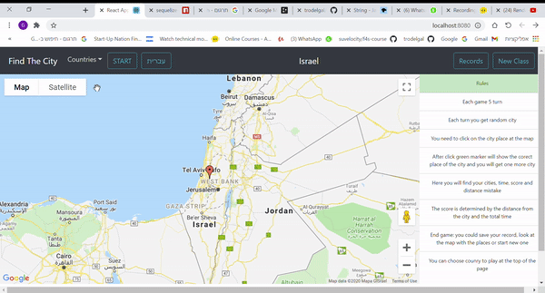
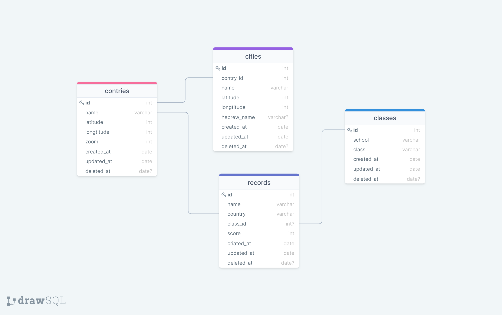

# FIND THE CITY GAME

 ## SERVER
- Server work with sequelize and express.
- Using express router for convenience.
- 4 sequelize models.
- Each model 1-3 EndPoint for get/post the relevant data.
- data folder with JSON files for seeders.
- validate file to validate the user input with JOI library.

## CLIENT
- Using React and React-Bootstrap for styling.
- 2 Dom-Router: Game page and Record page.
- Rules at the right side.
- Option to create a group (class) and get a class record table to compare the class students.
- Teacher code to create new class is- 123456123456.  
- Option to hebrew.
- Game Flow:

- vanila javasript version without styling and database.   

## DATABASE

## Getting Started

Clone this repo.   
- Setup server  
    1. `cd server`  
    2. `npm i` 
    3. Match the config file to your machine.
    4. `npx sequelize db:migrate `
    5. `npx sequelize db:seed:all `
    6. `npm run dev` / `node .`
- Setup client  
    1. `cd client`  
    2. `npm i` 
    3. `npm start`- for development
    4. `npm build`- for trying (`cd server` `node .` listen on port 8080)

 ## libraries 
 - sequelize
 - express
 - react 
 - react-dom
 - react-bootstrap
 - axios
 - react-google-maps

